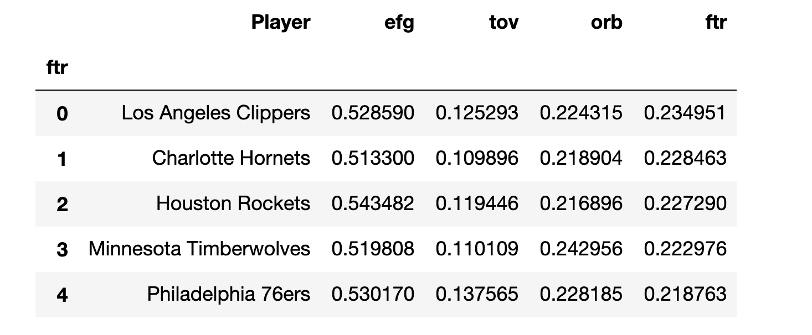
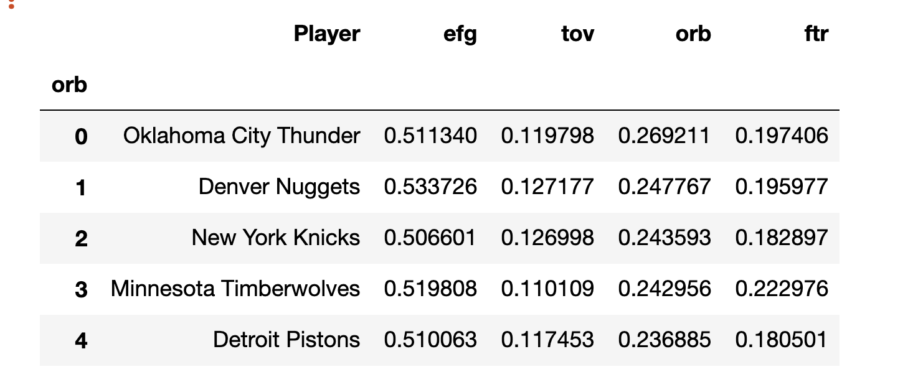
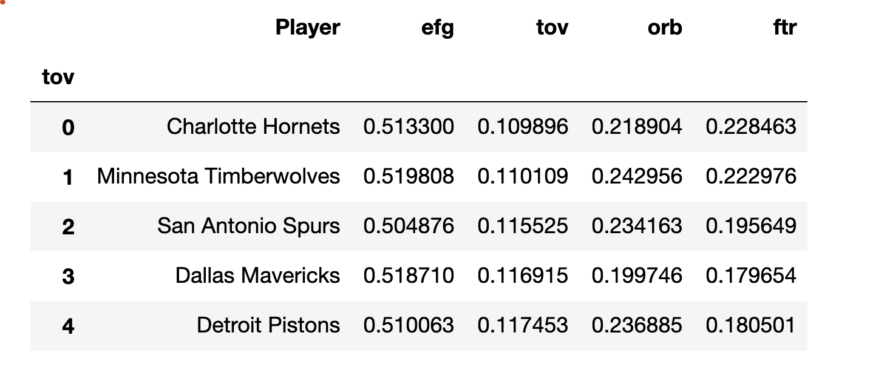

# NBA Four Factors

## Thesis

As a fan of NBA basketball, I have been fascinated by the impact analytics has had on the game over the past 10-15 years. Following the insight that 3pts > 2pts, teams started to significantly emphasize shooting 3pt shots, largely at the expense of the mid-range 2pt shot. There was a lot of research done into what key factors led to wins vs losses. The thesis I wanted to explore was do those factors look similar for home teams versus away teams and if not, which ones show variance. My bias was that road teams would not be as energetic as home teams and things like rebounding and turnovers could be an advantage for home teams. So I looked at the four factors and tested each to see if those two samples are statistically different.  

## Background

Dean Oliver, considered one of the innovators and early practicioner of applying statistics to basketball, has posited a way of looking at what drives wins in an NBA game, known as the Four Factor. His research shows there are Four Factors that drive wins for a team, in order of importance:

1. **Effective FG%**: effective field goal percent is an adjustment to the overall field goal statistic. The formula is (FGM + 0.5 * 3PFGM) / FGA. The more shots you make, the better your chances of winning and a 3 point made is 50% more valuable than 2 points. Dean has estimated that this factor weighting is about 40%.

2. **Turnover %**: Turnover percent is the rate at which the ball is turned over. A turnover results in zero attempts to score so you are not giving yourself a chance to add points when you turn the ball over. It is calculated as TOV / (FGA + 0.44 * FTA + TOV). TOV % is estimated at a weighting of 25%.

3. **Offensive Rebound %**: Offensive rebounds give you additional opportunities and conversely limit the other team from future opportunities. ORB is calculated as ORB / (ORB + DRB). The weighting estimated is 20%.

4. **FT Rate**: Finally, free throw rate is the amount of free throws a team had in a game. This is a metric that is not captured in field goals but is definitely a contributor to points scored. It is calculated as FT / FGA and its estimated weighting is 15%.

In this study, I will not analyze how effective these four factors are to determine a win or loss. The literature suggests they have a very strong predictive capability and we can return to how strong in a future analysis. 

***

# What am I testing for?

I am looking to determine the following: *Do NBA teams have a home court advantage?* I will analyze data from the 2017-2018 season, including playoffs. 
Looking at home teams and away teams, I will have two samples of:

> Regular Season: 82 games per team * 30 teams / 2 teams play at a time ==> 1230 

> Playoffs: will vary but for this season was 92

> Total: 1,230 + 92 = 1,322

I will perform 4 t-tests, one for each of the four factors. My **null hypothesis** for each test is there is no difference between home games and away games as it relates to the four factors. 
My **alternative hypothesis** is that there is a difference. I am using a two sided t-test as variance to either side of the distribution is relevant. My degrees of freedom are equal to my total sample observations (1,322 home games vs 1,322 away games) minus one but given the size of the samples being tested, I have not made ddof adjustments. 

***

# Techniques Used

I first scraped data by team for the 2017-2018 season from www.basketball-reference.com. I used pickle to create a series of unique identifiers for each game box score URL. I then set up a script to run a .py file with three functions. 

1. The first function scraped the specified page and got team box score data. This includes all the box score data for each player and team summaries. Note that I had to create two lists, one for team statistics and a separate one for the player or team name, and then combine them. My output was a pandas dataframe. 


2. The second function scraped a different part of the page with a summary box score. This included the teams that played, the location the game was played and time, and the final score. The output was a pandas dataframe. 


3. My third function took the above two dataframes and combined it into the information used for my analysis. Specifically, I needed to take team name from the second dataframe and combine it with the summary statistics from the first dataframe. The output was a pandas dataframe. 

I took the output of third dataframe and fed that into a PostGresSQL database in a Docker container. I ran the script on my local machine with an approximate run time of 5 hours, as I found I needed to add a sleep time of 15 seconds between scrapes to avoid getting timed out. 

After the 2017-2018 data was entered, I had a total of 2,644 rows of data to analyze, or 1,322 games. I then pulled the data into two pandas dataframe, one for home games and another for away games. I plotted histograms of the calculated four factors for home and away games. 

The file are linked below:

1. The file to create the pickle: 
1. The functions to create the dataframes: https://github.com/fayadabbasi/NBA_Four_Factors/blob/master/py_script/NBA_Four_Factors_Formulas_Two.py
2. The file with the script to process the functions and feed into the database: https://github.com/fayadabbasi/NBA_Four_Factors/blob/master/py_script/NBA_Database_File.py


# Findings

I was surprised to see how my normal distributions appeared, well normal. The Free Throw Rate distributions exhibited a slight right skew but otherwise the distributions appeared textbook. I then performed a t-test for each factor. As stated in the thesis, my bias was that a larger variance between home and away teams existed for hustle factors, such as rebounding and turnovers. What the data showed was the opposite. Turnover percent and offensive rebounding percent had p-values of 0.26 and 0.67, respectively. So despite the travel, road teams apparently get plenty of rest and are ready to play at game time. Based on the results of the t-test and the p-values, I could not reject my null hypothesis. 

Perhaps equally fascinating was that the effective field goal rate *did* show a materially relevant p-value at 6.04e-07. Free throw rate p-value was 0.028, resulting in our rejecting our null hypothesis for it as well. The home team apparently does have more comfort shooting in their own arena as indicated by the field goal rate and perhaps the home team does get more free throw attempts (perhaps driven by some favorable referee calls).  

### Effective Field Goal Percentage


```
The mean effective FG% for home games is 0.528 and the standard deviation is 0.0646
The mean effective FG% for away games is 0.516 and the standard deviation is 0.06459
Performing a t-test on the two samples, the t-statistic is 5.0 and the p-value is 6.044e-07

```

### Free Throw Rate


```
The mean Free Throw Rate for home games is 0.201 and the standard deviation is 0.07566
The mean Free Throw Rate for away games is 0.195 and the standard deviation is 0.07421
Performing a t-test on the two samples, the t-statistic is 2.2 and the p-value is 0.02818

```

### Offensive Rebound Percent


```
The mean Offensive Rebound Percent for home games is 0.222 and the standard deviation is 0.07029
The mean Offensive Rebound Percent for away games is 0.223 and the standard deviation is 0.07142
Performing a t-test on the two samples, the t-statistic is -0.432 and the p-value is 0.6656
```


### Turnover Percent


```
The mean Turnover Percent for home games is 0.124 and the standard deviation is 0.03244
The mean Turnover Percent for away games is 0.126 and the standard deviation is 0.03385
Performing a t-test on the two samples, the t-statistic is -1.13 and the p-value is 0.2579
```

### Team Leaders 

### Top Five Teams in Effective Field Goal rate


The top five teams came in at 2nd, 1st, 1st, 7th, and 6th in their respective divisions. 

It is interesting to see from this table above, Golden State was the clear leader in effective field goal percent but not nearly as strong in the other three metrics. Free throw rates came in lower than the leaders for Golden state but if GS is making shots, it seems to make sense that they do not have as many free throw attempts. Golden State was 2nd in their division but went on to win in the playoffs. 

### Top Five Teams in Free Throw rate


Top five teams came in at 10th, 10th, 1st, 8th and 3rd in their division.

The Charlotte Hornets were top two in Free Throw Rate and top of the league in turnover rate but were ranked 10th in their division and had a win percentage of 0.439. As I test to see what the weightings of each factor is, it will be interesting to see what the weightings for these factors actually is. Houston, with the best record, was in the top three for effective field goal rate and free throw rate, which suggests they had a fast paced, high shots on goal offense. 

### Top Five Teams in Offensive Rebound rate


Top five teams came in at 4th, 9th, 11th, 8th and 9th in their division. 

### Top Five Teams in Turnover rate


Top five teams came in at 10th, 8th, 7th, 13th and 9th in their division.

Given the somewhat limited representation in the top five, it seems the best teams were more consistently near the top but not necessarily at the top in any given category, with the key exception being effective field goal rate. For eFG, leading the league was a pretty strong determination of overall division rank. 


# Future Analysis

Additional tests to perform could include: 

> what is the impact of a multi-day road trip? More variance or the same results?

> how do these factors evolve over the past 10 years of NBA games? 15 years?

> how much do each of the four factors contribute to determining the outcome of a game? How has that evolved over the past 10 years? 15 years?

> which teams have the largest improvement year over year on the four factors and how did that translate to improved win totals

> visualize how shot distribution has resulted in hollowing out of the mid-range jump shot in the past 15 years. 

And much more. This is a pretty rich data set and with multiple years of data, I think there are endless questions to explore. 

# Technologies Demonstrated

 - Beautiful Soup
 - Pandas DataFrames
 - SQL Alchemy
 - PostgresSQL 
 - Matplotlib

# References

Thanks to Joseph Gartner, Dan Rupp, Brent Goldberg, Keatra Nesbitt from Galvanize for assistance in this process. Thanks to the many bloggers that have written about the Four Factors, including Square2020, Savvas Tjortjoglou, and others. Thanks to Basketball Reference for the data.  
